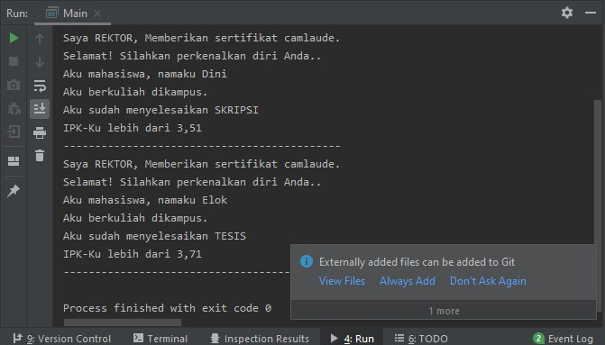
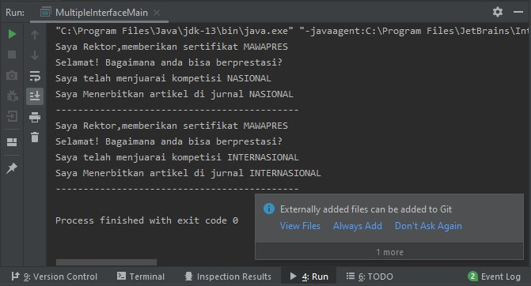
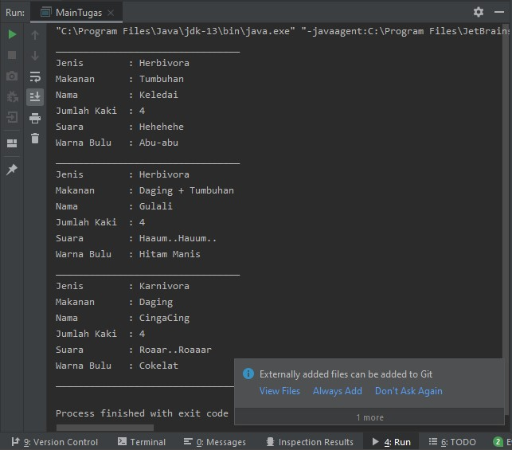
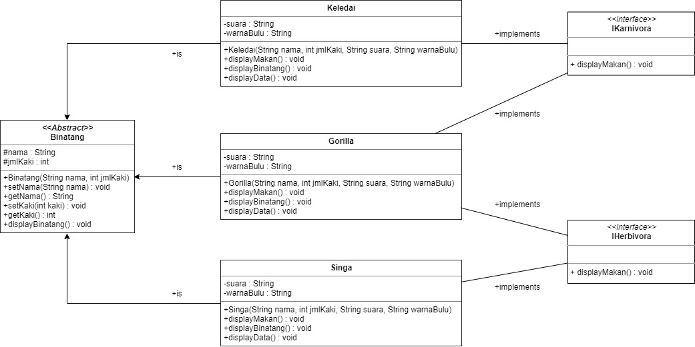

<h1>Laporan Pertemuan 11 - Interface </h1>

<h4>Praktikum Percobaan 1</h4>
    
    package com.interfacelatihan;

    public interface ICumlaude {
    public abstract void lulus();
    public abstract void meraihIPKTinggi();
    }
    
    package com.interfacelatihan;

    public class Mahasiswa implements ICumlaude{
    protected String nama;

    public Mahasiswa(String nama){
        this.nama = nama;
    }

    public void kuliahDiKampus(){
        System.out.println("Aku mahasiswa, namaku " + this.nama);
        System.out.println("Aku berkuliah dikampus.");
    }

    @Override
    public void lulus() {
        System.out.println("Aku mahasiswa, namaku " + this.nama);
    }

    @Override
    public void meraihIPKTinggi() {
        System.out.println("Aku berkuliah di kampus");
    }
    }

    package com.interfacelatihan;

    public class Sarjana extends Mahasiswa implements ICumlaude, IBerprestasi {
    public Sarjana(String nama){
        super(nama);
    }

    @Override
    public void lulus(){
        kuliahDiKampus();
        System.out.println("Aku sudah menyelesaikan SKRIPSI");
    }

    @Override
    public void meraihIPKTinggi(){
        System.out.println("IPK-Ku lebih dari 3,51");
    }

    @Override
    public void menjuaraiKompetisi() {
        System.out.println("Saya telah menjuarai kompetisi NASIONAL");
    }

    @Override
    public void membuatPublikasiIlmiah() {
        System.out.println("Saya Menerbitkan artikel di jurnal NASIONAL");
    }
    }
    
        package com.interfacelatihan;

        public class PascaSarjana extends Mahasiswa implements ICumlaude, IBerprestasi {
        public PascaSarjana(String nama){
            super(nama);
        }

        @Override
        public void lulus(){
            kuliahDiKampus();
            System.out.println("Aku sudah menyelesaikan TESIS");
        }

        @Override
        public void meraihIPKTinggi(){
            System.out.println("IPK-Ku lebih dari 3,71");
        }

        @Override
         public void menjuaraiKompetisi() {
        System.out.println("Saya telah menjuarai kompetisi INTERNASIONAL");
        }

        @Override
        public void membuatPublikasiIlmiah() {
        System.out.println("Saya Menerbitkan artikel di jurnal INTERNASIONAL");
        }
        }
        
        package com.interfacelatihan;

        public class Rektor {
        public void beriSertifikatCumlaude(ICumlaude mahasiswa){
        System.out.println("Saya REKTOR, Memberikan sertifikat camlaude.");
        System.out.println("Selamat! Silahkan perkenalkan diri Anda..");

        mahasiswa.lulus();
        mahasiswa.meraihIPKTinggi();

        System.out.println("--------------------------------------------");
        }

        public void beriSertifikatMawapres(IBerprestasi mahasiswa){
        System.out.println("Saya Rektor,memberikan sertifikat MAWAPRES");
        System.out.println("Selamat! Bagaimana anda bisa berprestasi?");

        mahasiswa.menjuaraiKompetisi();
        mahasiswa.membuatPublikasiIlmiah();

        System.out.println("--------------------------------------------");
        }
        }
        
<h4>Pertanyaan : </h4>
1. Pada langkah ke 9, pada baris program ke 3 terdapat warning pada script tersebut. Jelaskan penyebab terjadinya hal tersebut ? 
   Jawab : Karena class interface ICumlaude berada dalam satu package yang sama 
2. Pada langkah ke 9, pada baris program ke 3. Apa yang terjadi jika script tersebut dihilangkan? Jelaskan menurut pemahaman anda. 
   Jawab : Menurut saya, meskipun script tersebut dihilangkan, program akan tetap berjalan. Karena, terletak pada package yang sama. 
3. Mengapa pada langkah nomor 9 terjadi error? Jelaskan! 
   Jawab : Karena pada class mahasiswa belum diberikan implements ICumlaude 
4. Dapatkah method kuliahDiKampus() dipanggil dari objek sarjanaCumlaude di class Program? Mengapa demikian? 
   Jawab : Tidak. karena kuliahDikampus() bukan termasuk kedalam bagian implementasi. dimana method kuliahDikampus termasuk kedalam class Mahasiswa. 
5. Dapatkah method kuliahDiKampus() dipanggil dari parameter mahasiswa di method beriSertifikatCumlaude() pada class Rektor? Mengapa demikian? 
   Jawab : Tidak. Karena type parameter ICumlaude Rektor bukan Mahasiswa. 
6. Modifikasilah method beriSertifikatCumlaude() pada class Rektor agar hasil eksekusi class Program menjadi seperti berikut ini: 
   Jawab : tambahkan system.out.println() pada class Sarjana dan juga class PascaSarjana pada method lulus() 
    Output : 
    
    
 <h4>Percobaan 2</h4>
 
    package com.interfacelatihan;

    public interface IBerprestasi {
    public abstract void menjuaraiKompetisi();
    public abstract void membuatPublikasiIlmiah();
    }
    
    package com.interfacelatihan;

    public class MultipleInterfaceMain {
    public static void main(String[] args) {
        Rektor pakRektor = new Rektor();

        Sarjana sarjanaCum = new Sarjana("Dini");
        PascaSarjana masterCum = new PascaSarjana("Elok");

        pakRektor.beriSertifikatMawapres(sarjanaCum);
        pakRektor.beriSertifikatMawapres(masterCum);
    }
    }
<h4>Pertanyaan : </h4> 
1. Abstract tidak dapat bertipe protected dan juga private. 
2. Karena IBerprestasi merupakan abstract dan tidak dapat diintansiasi. kecuali di @override. 
3. Tambahkan System.out.println("Saya telah menjuarai kompetisi NASIONAL") pada class Sarjana method override menjuaraiKompetisi() 
   dan tambahkan juga System.out.println("Saya Menerbitkan artikel di jurnal NASIONAL") pada class Sarjana method override membuatPublikasiIlmiah() 
Output : 

<h3>Tugas Praktikum</h3>

    package com.tugas11;

    public interface Ikarnivora {
    public abstract void displayMakan();
    }

    package com.tugas11;

    public interface IHerbivora {
    public abstract void displayMakan();
    }

    package com.tugas11;

    abstract class Binatang {
    protected String nama;
    protected int jmlKaki;

    public Binatang(String nama, int jmlKaki){
        this.nama = nama;
        this.jmlKaki = jmlKaki;
    }

    public void setNama(String nama) {
        this.nama = nama;
    }

    public String getNama() {
        return nama;
    }

    public void setKaki(int jmlKaki) {
        this.jmlKaki = jmlKaki;
    }

    public int getKaki() {
        return jmlKaki;
    }

    public void displayBinatang(){

    }
    }
    
    package com.tugas11;

    public class Keledai extends Binatang implements IHerbivora{
    private String suara, warnaBulu;

    public Keledai(String nama, int jmlKaki, String suara, String warnaBulu){
        super(nama, jmlKaki);
        this.suara = suara;
        this.warnaBulu = warnaBulu;

    }

    @Override
    public void displayMakan() {
        System.out.println("Makanan\t\t : Tumbuhan");
    }

    @Override
    public void displayBinatang(){
        System.out.println("Jenis\t\t : Herbivora");
    }

    public void displayData(){
        System.out.println("Nama\t\t : " + getNama());
        System.out.println("Jumlah Kaki\t : " + getKaki());
        System.out.println("Suara\t\t : " + this.suara);
        System.out.println("Warna Bulu\t : " + this.warnaBulu);
    }
    }
    
    package com.tugas11;

    public class Singa extends Binatang implements Ikarnivora {
    private String suara, warnaBulu;

    public Singa(String nama, int jmlKaki, String suara, String warnaBulu){
        super(nama, jmlKaki);
        this.suara = suara;
        this.warnaBulu = warnaBulu;
    }

    @Override
    public void displayMakan(){
        System.out.println("Makanan\t\t : Daging");
    }

    @Override
    public void displayBinatang(){
        System.out.println("Jenis\t\t : Karnivora ");
    }

    public void displayData() {
        System.out.println("Nama\t\t : " + getNama());
        System.out.println("Jumlah Kaki\t : " + getKaki());
        System.out.println("Suara\t\t : " + this.suara);
        System.out.println("Warna Bulu\t : " + this.warnaBulu);
    }
    }
    
    package com.tugas11;

    public class Gorilla extends Binatang implements Ikarnivora, IHerbivora {
    private String suara, warnaBulu;

    public Gorilla(String nama, int jmlKaki, String suara, String warnaBulu){
        super(nama, jmlKaki);
        this.suara = suara;
        this.warnaBulu = warnaBulu;
    }

    @Override
    public void displayMakan() {
        System.out.println("Makanan\t\t : Daging + Tumbuhan");
    }

    @Override
    public void displayBinatang(){
        System.out.println("Jenis\t\t : Herbivora");
    }

    public void displayData(){
        System.out.println("Nama\t\t : " + getNama());
        System.out.println("Jumlah Kaki\t : " + getKaki());
        System.out.println("Suara\t\t : " + this.suara);
        System.out.println("Warna Bulu\t : " + this.warnaBulu);
    }
    }

    package com.tugas11;

    public class MainTugas {
    public static void main(String[] args) {
        Keledai keledai = new Keledai("Keledai", 4, "Hehehehe", "Abu-abu");
        Gorilla gorilla = new Gorilla("Gulali", 4, "Haaum..Hauum..", "Hitam Manis");
        Singa singa = new Singa("CingaCing", 4, "Roaar..Roaaar", "Cokelat");

        //Keledai
        System.out.println("_________________________________");
        keledai.displayBinatang();
        keledai.displayMakan();
        keledai.displayData();
        //Gorilla
        System.out.println("_________________________________");
        gorilla.displayBinatang();
        gorilla.displayMakan();
        gorilla.displayData();
        //Singa
        System.out.println("_________________________________");
        singa.displayBinatang();
        singa.displayMakan();
        singa.displayData();
        System.out.println("_________________________________");
    }
    }

 Output : 
   
 
