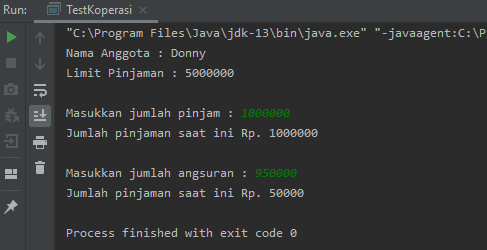

<h2>Laporan Praktikum 3 - Enkapsulasi Pada Pemrograman Berorientasi Objek

percobaan 1 dan 2

    package com.chika;
    
    public class Motor {
        private int kecepatan = 0;
        private boolean kontakOn = false;
    
        public void nyalakanMesin(){
            kontakOn = true;
        }
        public void matikanMesin(){
            kontakOn = false;
            kecepatan = 0;
        }
        public void tambahKecepatan(){
            if (kontakOn == true && kecepatan <= 100){
                kecepatan += 5;
            } else {
                System.out.println("Kecepatan tidak bisa bertambah karena Mesin Off! \n");
            }
        }
        public void kurangiKecepatan(){
            if (kontakOn == true){
                kecepatan -= 5;
            } else {
                System.out.println("Kecepatan tidak bisa berkurang karena Mesin Off! \n");
            }
        }
        public void printStatus(){
            if (kontakOn == true){
                System.out.println("Kontak On");
            } else {
                System.out.println("Kontak Off");
            }
            System.out.println("Kecepatan " + kecepatan + "\n");
        }
    }
    package com.chika;

    public class MotorDemo {
    public static void main(String[] args) {
        Motor motor = new Motor();
        motor.printStatus();
        motor.tambahKecepatan();

        motor.nyalakanMesin();
        motor.printStatus();

        motor.tambahKecepatan();
        motor.printStatus();

        motor.tambahKecepatan();
        motor.printStatus();

        motor.tambahKecepatan();
        motor.printStatus();

        motor.matikanMesin();
        motor.printStatus();
    }}
      
      
    3.3 Jawaban :
   
        1. Karena, saat menambah kecapatan tersebut,
           mesin masih dalam keadaan mati
        2. Agar tidak semua class bisa mengakses atribut kontakOn dan kecepatan.
        3. public void tambahKecepatan(){
            if (kontakOn == true && kecepatan <= 100){
                kecepatan += 5;
            } else {
            System.out.println("Kecepatan tidak bisa bertambah karena Mesin Off! \n");
            }
            
            
            
percobaan 3 dan 4

    package com.chika;

    public class Anggota {
    String nama, alamat;
    float simpanan;

    Anggota(String nama, String alamat){
        this.nama = nama;
        this.alamat = alamat;
        this.simpanan = 0;
    }

    public void setNama(String nama){
        this.nama = nama;
    }
    public void  setAlamat(String alamat){
        this.alamat = alamat;
    }
    public String getNama(){
        return nama;
    }
    public String getAlamat(){
        return alamat;
    }
    public float getSimpanan(){
        return simpanan;
    }
    public void setor(float uang){
        simpanan += uang;
    }
    public void pinjam(float uang){
        simpanan -= uang;
    }
    }
    
    package com.chika;
    
    public class KoperasiDemo{
        public static void main(String[] args) {
            Anggota anggota1 = new Anggota("Iwan", "Jalan Mawar");
            System.out.println("Simpanan " + anggota1.getNama()+ " : Rp. " + anggota1.getSimpanan());
    
            anggota1.setNama("Iwan Setiawan");
            anggota1.setAlamat("Jalan Sukarno Hatta No. 10");
            anggota1.setor(100000);
            System.out.println("Simpanan " + anggota1.getNama() + " : Rp. " + anggota1.getSimpanan());
    
            anggota1.pinjam(5000);
            System.out.println("Simpanan " + anggota1.getNama() + " : Rp. " + anggota1.getSimpanan());
        }
    }
    
    3.6 Jawaban
        1. Getter dan setter :
           Getter merupakan public method dan memiliki
           tipe data return sedangkan setter tidak memiliki
           tipe data return.
        2. berfungsi untuk mengambil nilai dari simpanan
        3. method void setor()
        4. Konstruktor mirip dengan method cara deklarasinya akan tetapi tidak memiliki tipe return. 
           Dan konsturktor dieksekusi ketika instan	dari objek dibuat.
        5. Aturan dalam membuat konstruktor :
            1. Nama konstruktor harus sama dengan nama class
            2. Konstruktor tidak memiliki tipe data return
            3. Konstruktor tidak boleh menggunakan modifier abstract,
               static, final, syncronized
        6. Tidak boleh.
        7. Setelah menambah konstruktor pada class.
        8. class method merupakan rancangan atau blueprint suatu objek.
           sedangkan instansiasi method merupakan proses mencetak objek dari
           class.
           
 Tugas Praktikum :
 
  1. Buat Program :
            
            package com.chika;
        
            public class EncapDemo{
            private String name;
            private int age;
        
            public String getName(){
                return name;
            }
            public void setName(String newName){
                name = newName;
            }
            public int getAge(){
                return age;
            }
            public void setAge(int newAge){
                if (newAge > 30){
                    age = 30;
                } else {
                    age = newAge;
                }
            }}
            
            package com.chika;
            
            public class EncapTest {
            
                public static void main(String[] args) {
            	EncapDemo encap = new EncapDemo();
            	encap.setName("James");
            	encap.setAge(35);
            
                    System.out.println("Name : " + encap.getName());
                    System.out.println("Age : " + encap.getAge());
                }
            }
            
            Output :
            
            
2. Karena pada setAge() telah ditentukan jika newAge lebih besar
   dari 30 maka umur yang muncul adalah 30.

3. Ubah program
    
        public void setAge(int newAge){
            if (newAge > 18){
                age = newAge;
            } else {
                System.out.println("Umur kurang dari batas minimal");
            }
        }

4. telah dimodifikasi pada nomor 5 dan 6

        package com.chika;
    
        public class Anggotaa {
        private int nik;
        private String nama;
        private int limit_peminjaman;
        private int jumlah_pinjaman;
    
        Anggotaa(int nik, String nama, int limit_peminjaman){
            this.nik = nik;
            this.nama = nama;
            this.limit_peminjaman = limit_peminjaman;
        }
        public void setNik(int nik){
            this.nik = nik;
        }
        public void setNama(String nama){
            this.nama = nama;
        }
        public String getNama(){
            return nama;
        }
        public int getNik(int nik){
            return nik;
        }
        public int getLimitPinjaman(){
            return limit_peminjaman;
        }
        public int getJumlahPinjaman(){
            return jumlah_pinjaman;
        }
        public void pinjam(int pinjam){
            if (pinjam <= 5000000 ){
                jumlah_pinjaman += pinjam;
            } else {
                System.out.println("Maaf, jumlah pinjaman melebihi limit");
            }
        }
        public void angsur(int uang){
            if (uang >= jumlah_pinjaman*10/100){
                jumlah_pinjaman -= uang;
            } else {
                System.out.println("Maaf, angsuran harus 10% dari jumlah pinjaman");
            }
        }}
5. telah di modifikasi

6.   hasil modifikasi :

            package com.chika;
            import java.util.Scanner;
            public class TestKoperasi {
            public static void main(String[] args) {
            Scanner in = new Scanner(System.in);
            Anggotaa donny = new Anggotaa(111333444, "Donny", 5000000);
            System.out.println("Nama Anggota : " + donny.getNama());
            System.out.println("Limit Pinjaman : " + donny.getLimitPinjaman());

            System.out.print("\nMasukkan jumlah pinjam : ");
            int pinjamUang = in.nextInt();
            donny.pinjam(pinjamUang);
            System.out.println("Jumlah pinjaman saat ini Rp. " + donny.getJumlahPinjaman());

            System.out.print("\nMasukkan jumlah angsuran : ");
            int angsurr= in.nextInt();
            donny.angsur(angsurr);
            System.out.println("Jumlah pinjaman saat ini Rp. " + donny.getJumlahPinjaman());
            }
           }
            
            