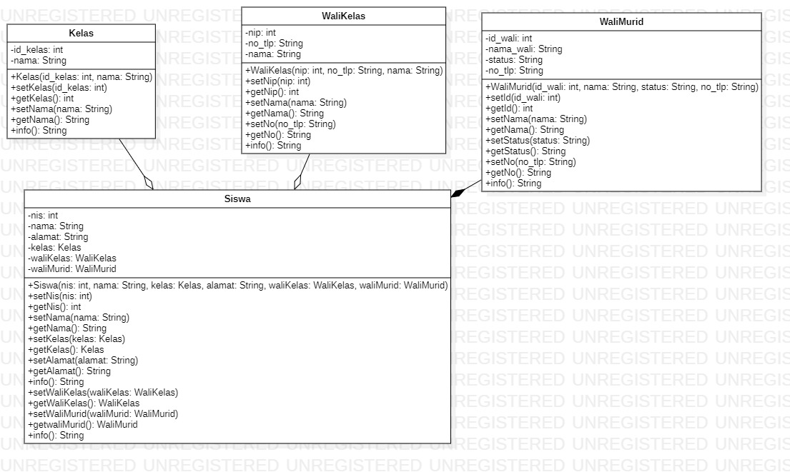

<h1> Laporan Tugas Praktikum 4 </h1>

Buatlah sebuah studi kasus, rancang dengan class diagram, kemudian implementasikan ke dalam
program! Studi kasus harus mewakili relasi class dari percobaan‑percobaan yang telah dilakukan
pada materi ini, setidaknya melibatkan minimal 4 class (class yang berisi main tidak dihitung).

Class Diagram :

