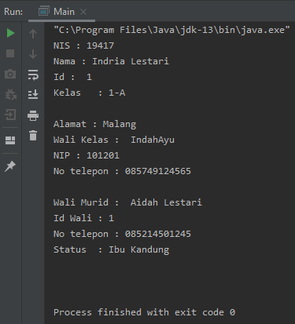

<h1> Laporan Tugas Praktikum 4 </h1>

Buatlah sebuah studi kasus, rancang dengan class diagram, kemudian implementasikan ke dalam
program! Studi kasus harus mewakili relasi class dari percobaan‑percobaan yang telah dilakukan
pada materi ini, setidaknya melibatkan minimal 4 class (class yang berisi main tidak dihitung).

Class Diagram :

Code :
Kelas.java 

package com.tugas4;

public class Kelas {
    private int id_kelas;
    private String nama;

    Kelas(int id_kelas, String nama){
        this.id_kelas = id_kelas;
        this.nama = nama;
    }
    public void setKelas(int id_kelas){
        this.id_kelas = id_kelas;
    }
    public void setNama(String nama){
        this.nama = nama;
    }
    public int getId_kelas(){
        return id_kelas;
    }
    public String getNama(){
        return nama;
    }
    public String info(){
        String info = " ";
        info += id_kelas + "\n";
        info += "Kelas\t: " + nama + "\n";
        return info;
    }
}

Code WaliKelas.java

package com.tugas4;

public class WaliKelas {
    private int nip;
    private String no_tlp;
    private String nama;

    WaliKelas(int nip, String no_tlp, String nama){
        this.nip = nip;
        this.no_tlp = no_tlp;
        this.nama = nama;
    }
    public void setNip(int nip){
        this.nip = nip;
    }
    public void setNo(String no_tlp){
        this.no_tlp = no_tlp;
    }
    public void setNama(String nama){
        this.nama = nama;
    }
    public int getNip(){
        return  nip;
    }
    public String getNo(){
        return no_tlp;
    }
    public String getNama(){
        return nama;
    }
    public String info(){
        String info = " ";
        info += nama + "\n";
        info += "NIP : " + nip + "\n";
        info += "No telepon : " + no_tlp + "\n";
        return info;
    }

}

Code WaliMurid.java

package com.tugas4;

public class WaliMurid {
    private int id_wali;
    private String no_tlp;
    private String nama_wali, status;

    WaliMurid(int id_wali, String  no_tlp, String nama, String status){
        this.id_wali = id_wali;
        this.no_tlp = no_tlp;
        this.nama_wali = nama;
        this.status = status;
    }
    public void setId(int id_wali){
        this.id_wali = id_wali;
    }
    public void setNo(String no_tlp){
        this.no_tlp = no_tlp;
    }

    public void setNama(String nama_wali) {
        this.nama_wali = nama_wali;
    }

    public void setStatus(String status) {
        this.status = status;
    }

    public int getId() {
        return id_wali;
    }

    public String getNo() {
        return no_tlp;
    }

    public String getNama() {
        return nama_wali;
    }

    public String getStatus() {
        return status;
    }
    public String info(){
        String info = " ";
        info += nama_wali + "\n";
        info += "Id Wali : " + id_wali + "\n";
        info += "No telepon : " + no_tlp + "\n";
        info += "Status\t: " + status + "\n";
        return info;
    }
}

Code Siswa.java

package com.tugas4;

public class Siswa {
    private String nama, alamat;
    private int nis;
    private Kelas kelas;
    private WaliKelas waliKelas;
    private WaliMurid waliMurid;

    Siswa(int nis, String nama, Kelas kelas, String alamat,  WaliKelas waliKelas, WaliMurid waliMurid){
        this.nis = nis;
        this.nama = nama;
        this.kelas = kelas;
        this.alamat = alamat;
        this.waliKelas = waliKelas;
        this.waliMurid = waliMurid;
    }

    public void setNis(int nis) {
        this.nis = nis;
    }

    public void setNama(String nama) {
        this.nama = nama;
    }

    public void setKelas(Kelas kelas) {
        this.kelas = kelas;
    }

    public void setAlamat(String alamat) {
        this.alamat = alamat;
    }

    public void setWaliKelas(WaliKelas waliKelas) {
        this.waliKelas = waliKelas;
    }

    public void setWaliMurid(WaliMurid waliMurid) {
        this.waliMurid = waliMurid;
    }

    public int getNis() {
        return nis;
    }

    public String getNama() {
        return nama;
    }

    public Kelas getKelas() {
        return kelas;
    }

    public String getAlamat() {
        return alamat;
    }

    public WaliKelas getWaliKelas() {
        return waliKelas;
    }

    public WaliMurid getWaliMurid() {
        return waliMurid;
    }

    public String info(){
        String info = "";
        info += "NIS : " + this.nis + "\n";
        info += "Nama : " + this.nama + "\n";
        info += "Id : " + this.kelas.info() + "\n";
        info += "Alamat : " + this.alamat + "\n";
        info += "Wali Kelas : " + this.waliKelas.info() + "\n";
        info += "Wali Murid : " + this.waliMurid.info() + "\n";
        return info;
    }
}

Code main.java

package com.tugas4;

public class Main {
    public static void main(String[] args) {
        Kelas kelas = new Kelas(1,"1-A");
        WaliKelas waliKelas = new WaliKelas(101201,"085749124565","IndahAyu");
        WaliMurid waliMurid = new WaliMurid(1,"085214501245","Aidah Lestari", "Ibu Kandung");
        Siswa siswa = new Siswa(19417,"Indria Lestari",kelas,"Malang",waliKelas,waliMurid);

        System.out.println(siswa.info());
    }
}

Ouput :

