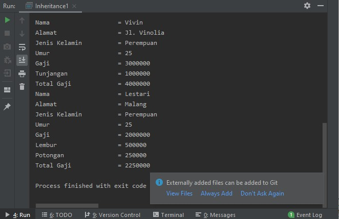
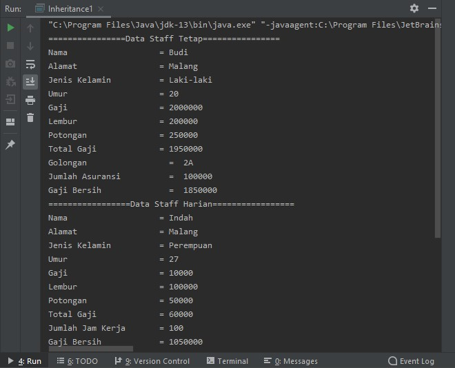
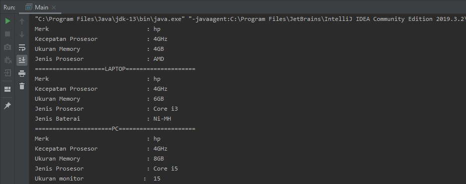
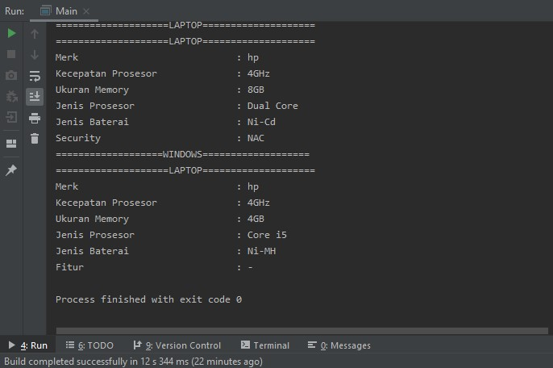

<h1>Laporan Pertemuan 7 - Inheritance(2)</h1>

<h3>Praktikum</h3>

Percobaan 1
  Source Code :
      
      package pertemuan7;
      public class Karyawan {
        public String nama, alamat, jk;
        public int umur, gaji;

        public Karyawan(){

        }
        public Karyawan(String nama, String alamat, String jk, int umur, int gaji){
            this.nama = nama;
            this.alamat = alamat;
            this.jk = jk;
            this.umur = umur;
            this.gaji = gaji;
        }
        public void tampilDataKaryawan(){
            System.out.println("Nama                   = " + nama);
            System.out.println("Alamat                 = " + alamat);
            System.out.println("Jenis Kelamin          = " + jk);
            System.out.println("Umur                   = " + umur);
            System.out.println("Gaji                   = " + gaji);
        }
        }
 
        
        package pertemuan7;
        public class Karyawan {
        public String nama, alamat, jk;
        public int umur, gaji;

        public Karyawan(){

        }
        public Karyawan(String nama, String alamat, String jk, int umur, int gaji){
            this.nama = nama;
            this.alamat = alamat;
            this.jk = jk;
            this.umur = umur;
            this.gaji = gaji;
        }
        public void tampilDataKaryawan(){
            System.out.println("Nama                   = " + nama);
            System.out.println("Alamat                 = " + alamat);
            System.out.println("Jenis Kelamin          = " + jk);
            System.out.println("Umur                   = " + umur);
            System.out.println("Gaji                   = " + gaji);
        }
        }
        
  
 
    package pertemuan7;
    public class Staff extends Karyawan {
    public int lembur, potongan;

    public Staff() {

    }
    public Staff(String nama, String alamat, String jk, int umur, int gaji, int lembur, int potongan){
        super(nama, alamat, jk, umur, gaji);
        this.lembur = lembur;
        this.potongan = potongan;
    }
    public void tampilDataStaff(){
        super.tampilDataKaryawan();
        System.out.println("Lembur                 = " + lembur);
        System.out.println("Potongan               = " + potongan);
        System.out.println("Total Gaji             = " + (gaji + lembur - potongan));
    }
    }
    
  
 
    package pertemuan7;
    public class Inheritance1 {
    public static void main(String[] args) {

        Manager M = new Manager();
        M.nama = "Vivin";
        M.alamat = "Jl. Vinolia";
        M.umur = 25;
        M.jk = "Perempuan";
        M.gaji = 3000000;
        M.tunjangan = 1000000;
        M.tampilDataManager();

        Staff S = new Staff();
        S.nama = "Lestari";
        S.alamat = "Malang";
        S.umur = 25;
        S.jk = "Perempuan";
        S.gaji = 2000000;
        S.lembur = 500000;
        S.potongan = 250000;
        S.tampilDataStaff();
    }
    }
 
   Output :
   
    
   Pertanyaan :
    
   1. Sebutkan class mana yang termasuk super class dan sub class dari percobaan 1 diatas!
      Jawab :
     2. Kata kunci apakah yang digunakan untuk menurunkan suatu class ke class yang lain?
      Jawab :
     3. Perhatikan kode program pada class Manager, atribut apa saja yang dimiliki oleh class tersebut? Sebutkan atribut mana saja yang diwarisi dari class Karyawan!
     Jawab :
     4. Jelaskan kata kunci super pada potongan program dibawah ini yang terdapat pada class Manager! System.out.println("Total Gaji = " + (super.gaji+tunjangan));
     Jawab :
     5. Program pada percobaan 1 diatas termasuk dalam jenis inheritance apa? Jelaskan alasannya!
     Jawab :
    
 

Percobaan 2
  Source Code :
 

    package pertemuan7;
    public class StaffTetap extends Staff{
    public String golongan;
    public int asuransi;

    public StaffTetap(){

    }
    public StaffTetap(String nama, String alamat, String jk, int umur,
                      int gaji, int lembur, int potongan, String golongan,
                      int asuransi){
        super(nama, alamat, jk, umur, gaji, potongan, lembur);
        this.golongan = golongan;
        this.asuransi = asuransi;
    }
    public void tampilStaffTetap(){
        System.out.println("================Data Staff Tetap================");
        super.tampilDataStaff();
        System.out.println("Golongan                 =  " +golongan);
        System.out.println("Jumlah Asuransi          =  " +asuransi);
        System.out.println("Gaji Bersih              =  " + (gaji + lembur - potongan - asuransi));
    }
    }
    
 

    package pertemuan7;
    public class StaffHarian extends Staff{
    public int jmljamKerja;

    public StaffHarian(){

    }
    public StaffHarian(String nama, String alamat, String jk, int umur,
                       int gaji, int lembur, int potongan, int jmljamKerja){
        super(nama, alamat, jk, umur, gaji, lembur, potongan);
        this.jmljamKerja = jmljamKerja;
    }
    public void tampilStaffHarian(){
        System.out.println("=================Data Staff Harian=================");
        super.tampilDataStaff();
        System.out.println("Jumlah Jam Kerja       = " + jmljamKerja);
        System.out.println("Gaji Bersih            = " +(gaji*jmljamKerja+lembur-potongan));
    }
    }
 

    package pertemuan7;
    public class Inheritance1 {
    public static void main(String[] args) {
        StaffTetap ST = new StaffTetap("Budi","Malang","Laki-laki",20,2000000,250000,200000,"2A",100000);
        ST.tampilStaffTetap();

        StaffHarian SH = new StaffHarian("Indah","Malang","Perempuan",27,10000,100000,50000,100);
        SH.tampilStaffHarian();
    }
    }
  
 Output :
 
  Pertanyaan :
  1. Berdasarkan class diatas manakah yang termasuk single inheritance
dan mana yang termasuk multilevel inheritance?
  Jawab :
 2. Perhatikan kode program class StaffTetap dan StaffHarian, atribut apa saja yang
dimiliki oleh class tersebut? Sebutkan atribut mana saja yang diwarisi dari class
Staff!
  Jawab :
 3. Apakah fungsi potongan program berikut pada class StaffHarian super(nama,alamat,jk,umur,gaji,lembur,potongan); ?
  Jawab : 
 4. Apakah fungsi potongan program berikut pada class StaffHarian super.tampilDataStaff(); ?
  Jawab : 
 5. Perhatikan kode program dibawah ini yang terdapat pada class StaffTetap System.out.println("Gaji Bersih =  " + (gaji + lembur - potongan - asuransi));
Terlihat dipotongan program diatas atribut gaji, lembur dan potongan dapat diakses
langsung. Kenapa hal ini bisa terjadi dan bagaimana class StaffTetap memiliki atribut gaji,
lembur, dan potongan padahal dalam class tersebut tidak dideklarasikan atribut gaji, lembur,
dan potongan?
  Jawab :
 
<h3> Tugas Praktikum </h3>
 
Buatlah sebuah program dengan konsep pewarisan seperti pada class diagram berikut ini : Komputer, Leptop, Pc, Mac, dan Windows.
Kemudian buatlah instansiasi objek untuk menampilkan data pada class Mac, Windows dan
Pc!.
 
Source Code :
 
    
    package TugasPertemuan7;
    public class Komputer {
    public String merk, jnsProsesor;
    public int kecProsesor, sizeMemory;

    public Komputer(){

    }
    public Komputer(String merk, int kecProsesor, int sizeMemory, String jnsProsesor){
        this.merk = merk;
        this.kecProsesor = kecProsesor;
        this.sizeMemory = sizeMemory;
        this.jnsProsesor = jnsProsesor;
    }
    public void tampilData(){
        System.out.println("Merk                            : " + merk);
        System.out.println("Kecepatan Prosesor              : " + kecProsesor + "GHz");
        System.out.println("Ukuran Memory                   : " + sizeMemory + "GB");
        System.out.println("Jenis Prosesor                  : " + jnsProsesor);
    }
    }
    
 
    
    package TugasPertemuan7;
    public class Leptop extends Komputer{
    public String jnsBatrei;
    public Leptop(){

    }
    public Leptop(String merk, int kecProsesor, int sizeMemory, String jnsProsesor,
                  String jnsBatrei){
        super(merk,kecProsesor,sizeMemory,jnsProsesor);
        this.jnsBatrei = jnsBatrei;
    }
    public void tampilLeptop(){
        System.out.println("====================LAPTOP====================");
        super.tampilData();
        System.out.println("Jenis Baterai                   : " + jnsBatrei);
    }
    }
    
 
    
    package TugasPertemuan7;
    public class Pc extends Komputer {
    public int ukuranMonitor;

    public Pc(){

    }
    public Pc(String merk, int kecProsesor, int sizeMemory, String jnsProsesor,
              int ukuranMonitor){
        super(merk, kecProsesor, sizeMemory, jnsProsesor);
        this.ukuranMonitor = ukuranMonitor;
    }
    public void tampilPc() {
        System.out.println("======================PC======================");
        super.tampilData();
        System.out.println("Ukuran monitor                 :  " + ukuranMonitor);
    }
    }
    
 
    
    package TugasPertemuan7;
    public class Mac extends Leptop {
    public String security;
    
    public Mac(){

    }
    public Mac(String merk, int kecProsesor, int sizeMemory, String jnsProsesor,
               String jnsBatrei, String security){
        super(merk, kecProsesor, sizeMemory, jnsProsesor, jnsBatrei);
        this.security = security;
    }
    public void tampilMac(){
            System.out.println("====================LAPTOP====================");
            super.tampilLeptop();
        System.out.println("Security                        : " + security);
    }
    }
    
 
    
    package TugasPertemuan7;
    public class Windows extends Leptop {
    public String fitur;

    public Windows(){

    }
    public Windows(String merk, int kecProsesor, int sizeMemory, String jnsProsesor,
                   String jnsBatrei, String fitur){
        super(merk, kecProsesor, sizeMemory, jnsProsesor, jnsBatrei);
        this.fitur = fitur;
    }
    public void tampilWindows(){
        System.out.println("===================WINDOWS===================");
        super.tampilLeptop();
        System.out.println("Fitur                           : " + fitur);
    }
    }
    
 
    
        package TugasPertemuan7;
        public class Main {
        public static void main(String[] args) {
        Komputer komputer = new Komputer("hp", 4, 4, "AMD");
        komputer.tampilData();

        Leptop leptop = new Leptop("hp", 4, 6, "Core i3","Ni-MH");
        leptop.tampilLeptop();

        Pc pc = new Pc("hp", 4, 8,"Core i5",15);
        pc.tampilPc();

        Mac mac = new Mac("hp", 4, 8, "Dual Core","Ni-Cd", "NAC");
        mac.tampilMac();

        Windows windows = new Windows("hp", 4, 4, "Core i5", "Ni-MH", "-");
        windows.tampilWindows();
        }
        }
 
Output :

