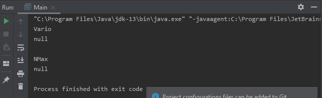

<h1>Laporan Ujian Tengah Semester</h1>
 
Sebelum perbaikan :

Setelah perbaikan :
 

 
Source Code :  

    package com.uts;

    public class SepedaMotor extends Mesin{
    private Mesin mesin ;
    private String merekMotor;

    SepedaMotor(String merekMotor, String merek){
        super.merek = merekMotor;
        this.merekMotor = merek;
    }

    public void setMerekMotor(String merekMesin) {
        this.merekMotor = merekMotor;
    }

    public String getMerekMotor() {
        return merekMotor;
    }

    public String getMerekMesin(){
        return super.getMerek();
    }

    public void tambahKecepatanMotor() {
        super.tambahKecepatan();
    }
    public void kurangiKecepatanMotor(){
        super.kurangiKecepatan();
    }
    }
  
    
    package com.uts;
    public class Mesin{
    public  String merek;
    public double kecepatan = 0;

    Mesin(){

    }

    public void setMerek(String merekMesin) {
        this.merek = merek;
    }

    public String getMerek() {
        return merek;
    }

    public double getKecepatan() {
        return kecepatan;
    }

    public void tambahKecepatan(){
        if (getMerek().equalsIgnoreCase("yamaha")){
            System.out.println((kecepatan += 15) + ("km/jam"));
        } else {
            System.out.println((kecepatan += 10) + ("km/jam"));
        }
    }

    public void kurangiKecepatan(){
        if(getMerek().equalsIgnoreCase("yamaha")){
            System.out.println("" + (kecepatan -= 10) + ("km/jam"));
        } else {
            System.out.println("" + (kecepatan -= 5) + ("km/jam"));
        }
    }
    }
  
 
    package com.uts;

    public class Main {

    public static void main(String[] args) {
	// write your code here
        SepedaMotor honda = new SepedaMotor("Vario", "Honda");
        System.out.println(honda.getMerekMotor());
        System.out.println(honda.getMerekMesin());
        honda.tambahKecepatanMotor();
        honda.tambahKecepatanMotor();
        honda.kurangiKecepatanMotor();

        System.out.println();
        SepedaMotor yamaha = new SepedaMotor("NMax","Yamaha");
        System.out.println(yamaha.getMerekMotor());
        System.out.println(yamaha.getMerekMesin());
        yamaha.tambahKecepatanMotor();
        yamaha.tambahKecepatanMotor();
        yamaha.kurangiKecepatanMotor();
        }
    }
