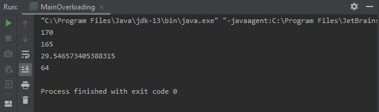
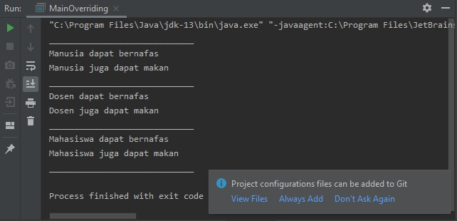

<h1>Laporan Pertemuan 9 - Overloading & Overriding</h1>
 
<h3> Percobaan 1</h3>
 

    package com.percobaan1;

    public class Karyawan {

    private String nama, nip, golongan;
    private double gaji;

    public void setNama(String nama){
        this.nama = nama;
    }

    public void setNip(String nip) {
        this.nip = nip;
    }

    public void setGolongan(String golongan) {
        this.golongan = golongan;

        switch (golongan.charAt(0)) {
            case '1': this.gaji = 5000000;
                break;
            case '2': this.gaji = 3000000;
                break;
            case '3' : this.gaji = 2000000;
                break;
            case '4' : this.gaji = 1000000;
                break;
            case '5' : this.gaji = 7500000;
                break;
        }
    }

    public void setGaji(double gaji) {
        this.gaji = gaji;
    }

    public String getNama() {
        return nama;
    }

    public String getNip() {
        return nip;
    }

    public String getGolongan() {
        return golongan;
    }

    public double getGaji() {
        return gaji;
    }
    }
 

    package com.percobaan1;

    public class Staff extends Karyawan{
    private int lembur;
    private double gajiLembur;

    public void setLembur(int lembur) {
        this.lembur = lembur;
    }

    public int getLembur() {
        return lembur;
    }

    public void setGajiLembur(double gajiLembur) {
        this.gajiLembur = gajiLembur;
    }

    public double getGajiLembur() {
        return gajiLembur;
    }

    public double getGaji(int lembur, double gajiLembur) {
        return super.getGaji() + lembur * gajiLembur;
    }

    public double getGaji() {
        return super.getGaji() + lembur * gajiLembur;
    }

    public void lihatInfo(){
        System.out.println("-------------------------------------");
        System.out.println("NIP\t\t\t\t : " + this.getNip());
        System.out.println("Nama\t\t\t : " + this.getNama());
        System.out.println("Golongan\t\t : " + this.getGolongan());
        System.out.println("Jumlah Lembur\t : " + this.getLembur());
        System.out.printf("Gaji Lembur\t\t : %.0f\n", this.getGajiLembur());
        System.out.printf("Gaji\t\t\t : %.0f" , this.getGaji());
        System.out.println();
    }
    }

    package com.percobaan1;

    public class Manager extends Karyawan {
    private  double tunjangan;
    private String bagian;
    private Staff st[];

    public void setTunjangan(double tunjangan) {
        this.tunjangan = tunjangan;
    }

    public double getTunjangan() {
        return tunjangan;
    }

    public void setBagian(String bagian) {
        this.bagian = bagian;
    }

    public String getBagian() {
        return bagian;
    }

    public void setStaff(Staff st[]) {
        this.st = st;
    }

    public void viewStaff(){
        int i;
        System.out.println("-------------------------------------");
        for (i = 0; i < st.length; i++) {
            st[i].lihatInfo();
        }
        System.out.println("-------------------------------------");
    }

    public void lihatInfo(){
        System.out.println("_____________________________________");
        System.out.println("Manager\t\t\t : " + this.getBagian());
        System.out.println("NIP\t\t\t\t : " + this.getNip());
        System.out.println("Nama\t\t\t : " + this.getNama());
        System.out.println("Golongan\t\t : " + this.getGolongan());
        System.out.printf("Tunjangan\t\t : %.0f\n", this.getGaji());
        System.out.printf("Gaji\t\t\t : %.0f\n", this.getGaji());
        System.out.println("Bagian\t\t\t : " + this.getBagian());
        this.viewStaff();
    }

    @Override
    public double getGaji() {
        return super.getGaji() + tunjangan;
    }
    }

    package com.percobaan1;

    public class Utama {

    public static void main(String[] args) {
	// write your code here
        System.out.println("_____________________________________");
        System.out.println("Program Testing Class Manager & Staff");
        Manager man[] = new Manager[2];
        Staff staff1[] = new Staff[2];
        Staff staff2[] = new Staff[3];

        //pembuatan manager

        man[0] = new Manager();
        man[0].setNama("Tedjo");
        man[0].setNip("101");
        man[0].setGolongan("1");
        man[0].setTunjangan(5000000);
        man[0].setBagian("Administrasi");

        man[1] = new Manager();
        man[1].setNama("Atika");
        man[1].setNip("102");
        man[1].setGolongan("1");
        man[1].setTunjangan(2500000);
        man[1].setBagian("Pemasaran");

        staff1[0] = new Staff();
        staff1[0].setNama("Usman");
        staff1[0].setNip("0003");
        staff1[0].setGolongan("2");
        staff1[0].setLembur(10);
        staff1[0].setGajiLembur(10000);

        staff1[1] = new Staff();
        staff1[1].setNama("Anugrah");
        staff1[1].setNip("0005");
        staff1[1].setGolongan("2");
        staff1[1].setLembur(10);
        staff1[1].setGajiLembur(55000);
        man[0].setStaff(staff1);

        staff2[0] = new Staff();
        staff2[0].setNama("Hendra");
        staff2[0].setNip("0004");
        staff2[0].setGolongan("3");
        staff2[0].setLembur(15);
        staff2[0].setGajiLembur(5500);

        staff2[1] = new Staff();
        staff2[1].setNama("Arie");
        staff2[1].setNip("0006");
        staff2[1].setGolongan("4");
        staff2[1].setLembur(5);
        staff2[1].setGajiLembur(100000);

        staff2[2] = new Staff();
        staff2[2].setNama("Mentari");
        staff2[2].setNip("0007");
        staff2[2].setGolongan("3");
        staff2[2].setLembur(6);
        staff2[2].setGajiLembur(20000);
        man[1].setStaff(staff2);

        //cetak informasi dari manager + staffnya
        man[0].lihatInfo();
        man[1].lihatInfo();
    }
    }
  
 <h3>Latihan</h3>
  
    
    package com.latihan;

    public class PerkalianKu {
    public void perkalian(int a, int b){
        System.out.println(a * b);
    }
    public void perkalian(int a, int b, int c){
        System.out.println(a * b * c);
    }

    public static void main(String[] args) {
        PerkalianKu objek = new PerkalianKu();

        objek.perkalian(25, 43);
        objek.perkalian(34, 23, 56);
    }
    }
    
    1. Dari source coding diatas terletak dimanakah overloading? 
	     terletak pada method perkalian dimana terdapat 2 method dengan 	nama yang sama, tetapi memiliki parameter berbeda. 
    2. Jika terdapat overloading ada berapa jumlah parameter yang berbeda? 
	     terdapat 1 parameter yang berbeda. yaitu dengan menambahkan int c
   
   
    package com.latihan;

    public class PerkalianKu {
    public void perkalian(int a, int b){
        System.out.println(a * b);
    }
    public void perkalian(double a, double b){
        System.out.println(a * b);
    }

    public static void main(String[] args) {
        PerkalianKu objek = new PerkalianKu();

        objek.perkalian(25, 43);
        objek.perkalian(34.56,23.7);
    }
    }
    
    3. Dari source coding diatas terletak dimanakah overloading? 
	     terletak pada method perkalian dimana terdapat 2 method dengan nama yang sama, tetapi memiliki parameter berbeda. 
    4. Jika terdapat overloading ada berapa tipe parameter yang berbeda? 
	     terdapat 2 parameter yang berbeda. yaitu double a, double b
     
    
    package com.latihan;

    public class Ikan {
    public void swim(){
        System.out.println("Ikan bisa berenang");
    }
    }
    package com.latihan;
    
    public class Piranha extends Ikan {
    public void swim() {
        System.out.println("Piranha bisa makan daging");
    }
    package com.latihan;

    public class Fish {
    public static void main(String[] args) {
        Ikan a = new Ikan();
        Ikan b = new Piranha();

        a.swim();
        b.swim();
    }
     
    5. Dari source coding diatas terletak dimanakah overriding? 
	     Overriding terletak pada method swim(). dimana method swim() 	digunakan lagi pada subclass dengan mengubah inputan. 
    6. Jabarkanlah apabila sourcoding diatas jika terdapat overriding? 
	     Pada source coding diatas dapat saya jabarkan bahwa method swim() pada class Ikan dapat diakses oleh subclass dengan
       mengubah inputan ataupun tanpa mengubah inputan dalam method swim().
     
    
<h3>Tugas</h3>
 
1. Overloading  

    
    	package com.Tugas;
    
    	public class Segitiga {
    	private int sudut;

    	public int totalSudut(int sudutA){
        return sudut = 180 - sudutA;
    	}
    	public int totalSudut(int sudutA, int sudutB){
        return sudut = 180 - (sudutA + sudutB);
    	}
    	public int keliling(int sisiA, int sisiB, int sisiC){
        int keliling = sisiA + sisiB + sisiC;
        return keliling;
    	}
    	public double keliling(int sisiA, int sisiB){
        double c = Math.sqrt(Math.pow(sisiA, 2) + Math.pow(sisiB, 2));
        return c;
    	} }
   
   	package com.Tugas;

    	public class MainOverloading {
    	public static void main(String[] args) {
        Segitiga segitiga = new Segitiga();

        System.out.println(segitiga.totalSudut(10));
        System.out.println(segitiga.totalSudut(10,5));
        System.out.println( segitiga.keliling(12,27));
        System.out.println( segitiga.keliling(12,25,27));

    	}
    	}
	
Output :
 

 
    
2. Overriding 

    	package com.Tugas;

    	public class Manusia {
    	public void bernafas(){
        System.out.println("Manusia dapat bernafas");
    	}
    	public void makan(){
        System.out.println("Manusia juga dapat makan");
    	}
    	}
    
    	package com.Tugas;

    	public class Dosen extends Manusia{

    	public void bernafas() {
        System.out.println("Dosen dapat bernafas");
    	}

    	public void makan() {
        System.out.println("Dosen juga dapat makan");
    	}
    	}
    
    	package com.Tugas;

    	public class Mahasiswa extends Manusia{

    	public void bernafas() {
        System.out.println("Mahasiswa dapat bernafas");
    	}

    	public void makan() {
        System.out.println("Mahasiswa juga dapat makan");
    	}
    	}
    
    	package com.Tugas;

    	public class MainOverriding {
    	public static void main(String[] args) {
        Manusia a = new Manusia();
        Manusia b = new Dosen();
        Manusia c = new Mahasiswa();

        System.out.println("_____________________________");
        a.bernafas();
        a.makan();
        System.out.println("_____________________________");
        b.bernafas();
        b.makan();
        System.out.println("_____________________________");
        c.bernafas();
        c.makan();
        System.out.println("_____________________________");
    	}
    	}
    
    Output :
     
    
     

    
