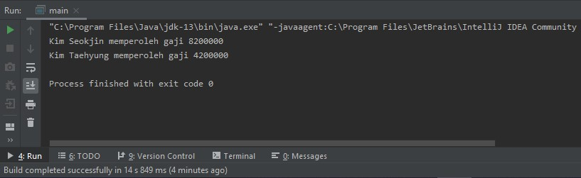

<h1> Laporan Praktikum dan Tugas Praktikum Inheritance(1)</h1>
 

Percobaan 1
  
    package com.percobaan1;

    public class ClassA {
    public int x, y;

    public void getNilai(){
        System.out.println("Nilai x : " + x);
        System.out.println("Nilai y : " + y);
    }
    }
    
    package com.percobaan1;

    public class ClassB extends ClassA {
    public int z;

    public void getNilaiZ(){
        System.out.println("Nilai z : " + z );
    }
    public void getJumlah(){
        System.out.println("Jumlah : " + (x+y+z));
    }
    }
    
    package com.percobaan1;

    public class Percobaan1 {

    public static void main(String[] args) {

        ClassB hitung = new ClassB();
        hitung.x = 20;
        hitung.y = 30;
        hitung.z = 5;
        hitung.getNilai();
        hitung.getNilaiZ();
    }
    }
    
    Pertanyaan :
    1. memperbaiki program dengan menambahkan extends ClassA pada ClassB
    2. Penyebab dari error tersebut adalah variabel x dan y tidak ditemukan pada ClassB karena ClassA belum di extends pada ClassB 
       sehingga tidak dapat diakses pada Class Main Percobaan1.
       
       
Percobaan 2 

    package com.percobaan2;

    public class ClassA{
    public int x, y;

    public void setX(int x){
        this.x = x;
    }
    public void setY(int y){
        this.y = y;
    }
    public void getNilai(){
        System.out.println("Nilai x : " + x);
        System.out.println("Nilai y : " + y);
    }
    }
    
    package com.percobaan2;

    public class ClassB extends ClassA{
    private int z;

    public void setZ(int z){
        this.z = z;
    }
    public void getNilaiZ(){
        System.out.println("Nilai Z : " + z);
    }
    public void getJumlah(){
        System.out.println("Jumlah : " + (x+y+z));
    }
    }
    
    package com.percobaan2;

    public class Percobaan2 {
    public static void main(String[] args) {
        ClassB hitung = new ClassB();
        hitung.setX(20);
        hitung.setY(30);
        hitung.setZ(5);
        hitung.getNilai();
        hitung.getNilaiZ();
        hitung.getJumlah();
    }
    }
    
    Pertanyaan :
    1. memperbaiki program dengan menambahkan extends ClassA pada ClassB, kemudian pada ClassA merubah tipe atribut menjadi public 
       karena jika private maka meskipun diextends atribut tersebut tidak dapat diakses oleh Class lain.
    2. Penyebab dari error tersebut adalah ClassA belum diextends pada ClassB, selain itu pada Atribut di ClassA bertipe private 
       sehingga ClassB tidak dapat mengakses ClassA meskipun ClassA telah diextends pada ClassB.
    
Percobaan 3

    package com.percobaan3;

    public class Bangun {
    protected double phi;
    protected int r;
    }

    package com.percobaan3;

    public class Tabung extends Bangun {
    protected int t;

    public void setSuperPhi(double phi){
        super.phi = phi;
    }
    public void setSuperR(int r){
        super.r = r;
    }
    public void setT(int t){
        this.t = t;
    }
    public void volume(){
        System.out.println("Volume Tabung adalah : " + (super.phi*super.r*super.r*this.t));
    }
    }
    
    package com.percobaan3;

    public class Percobaan3 {
    public static void main(String[] args) {
        Tabung tabung = new Tabung();
        tabung.setSuperPhi(3.14);
        tabung.setSuperR(10);
        tabung.setT(3);
        tabung.volume();
    }
    }
    
    Pertanyaan :
    1. Fungsi super pada super.phi dan super.r adalah untuk mengakses atribut dari superclass.
    2. Berfungsi untuk menampilkan isi atribut dari superclass dan juga dari variabel t.
    3. Karena class Bangun merupakan subclass dari class Tabung, sehingga atribut pada class Bangun 
       dapat diakses pada class Tabung tanpa perlu mendefinisikan lagi atribut tersebut pada class Tabung.
       
Percobaan 4

    package com.percobaan4;

    public class ClassA {
    ClassA(){
        System.out.println("Konstruktor A dijalankan");
    }
    }
    
    package com.percobaan4;

    public class ClassB extends ClassA {
    ClassB(){
        System.out.println("Konstruktor B dijalankan");
    }

    }
    
    
    package com.percobaan4;

    public class ClassC extends ClassB{
    ClassC(){
        super();
        System.out.println("Konstruktor C dijalankan");
    }
    }
    
    package com.percobaan4;

    public class Percobaan4 {
    public static void main(String[] args) {
        ClassC test = new ClassC();
    }
    }
    
    Pertanyaan :
    1. ClassA merupakan subclass dari ClassB dan juga ClassC, ClassB merupakan subclass dari Class C , 
       kemudian ClassC merupakan superclass.
    2. Tidak terdapat perbedaan.
    3. ClassA merupakan subclass dari ClassB, kemudian ClassB merupakan subclass dari ClassC sehingga 
       ClassC dapat mengakses isi dari ClassB dan otomatis ClassA juga menjadi subclass dari ClassC.
    4. super() berfungsi mengeksekusi konstruktor induk

Tugas Praktikum

    package com.tugas6;

    public class DaftarGaji {

    private Pegawai[] listPegawai;
    private int jumlahPegawaiSekarang = 0;

    public DaftarGaji(int jumlah_pegawai){
        listPegawai = new Pegawai[jumlah_pegawai];
    }

    public void addPegawai(Pegawai pegawai){
        listPegawai[jumlahPegawaiSekarang] = pegawai;
        jumlahPegawaiSekarang++;
    }

    public void printGaji(){
        for (int i = 0; i < jumlahPegawaiSekarang; i++){
            System.out.print(listPegawai[i].getNama() +" memperoleh gaji ");
            System.out.println(listPegawai[i].getGaji());
        }
    }
    }
    
    
    package com.tugas6;

    public class Dosen extends Pegawai{

    private int jumlahSKS;
    private final int TARIF_SKS = 250000;

    public Dosen(){

    }

    public Dosen(String nip, String nama, String alamat) {
        super(nip, nama, alamat);
    }

    public void setSKS(int SKS){
        this.jumlahSKS = SKS;
    }

    @Override
    public int getGaji(){
        int total_gaji = jumlahSKS * TARIF_SKS;
        return total_gaji + super.getGaji();
    }
    }
    
    package com.tugas6;

    public class Pegawai {

    private String nip, nama, alamat;

    public Pegawai(){

    }

    public Pegawai(String nip, String nama, String alamat) {
        this.nip = nip;
        this.nama = nama;
        this.alamat = alamat;
    }

    public void setNama(String nama){
        this.nama = nama;
    }

    public String getNama(){
        return this.nama;
    }

    public int getGaji(){
        return 4200000;
    }
    }

      
    package com.tugas6;

    public class main {
    public static void main(String[] args) {
        Dosen dosen = new Dosen("145621","Kim Seokjin","Seoul");
        dosen.setSKS(16);

        Pegawai pegawai = new Pegawai("145622", "Kim Taehyung", "Seoul");

        DaftarGaji daftarGaji = new DaftarGaji(100);
        daftarGaji.addPegawai(dosen);
        daftarGaji.addPegawai(pegawai);
        daftarGaji.printGaji();
    }
    }
    
    Output :
    
