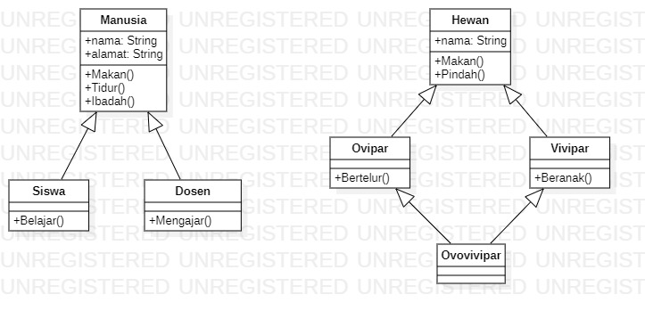

<h1> Laporan Tugas Teori </h1>

Studi Kasus

Class Manusia merupakan superclass dimana Class Siswa dan Class Dosen merupakan subclass. Jadi, termasuk kedalam Hierarchical Inheritance
Selanjutnya Terdapat Class Hewan merupakan superclass dimana Class Ovipar dan Vivipar merupakan subclass kemudian dikarenakan Class
Ovovivipar merupakan subclass dari Class Ovipar dan juga Vivipar. Jadi, Termasuk Hybrid Inheritance.
Dibawah ini merupakan Gambar UML :

